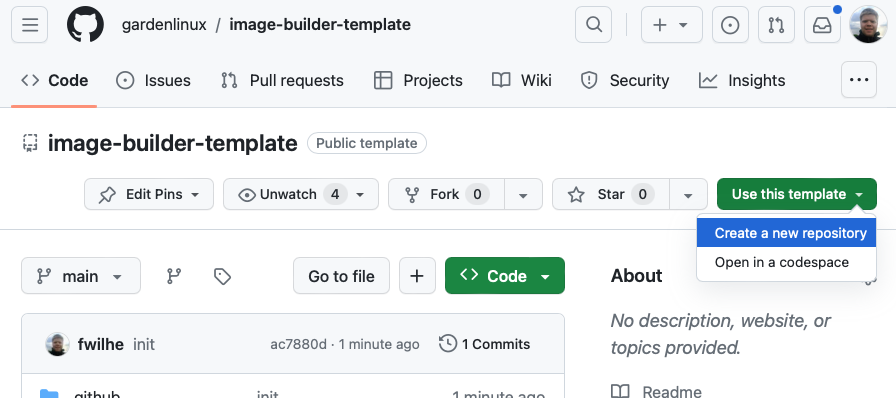
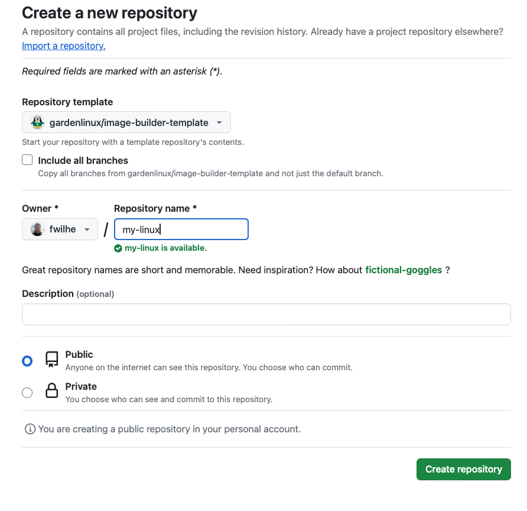
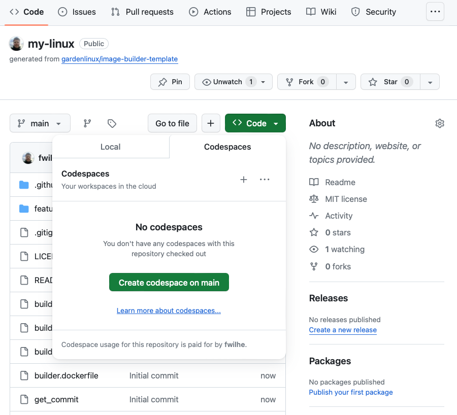
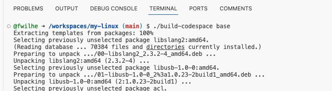
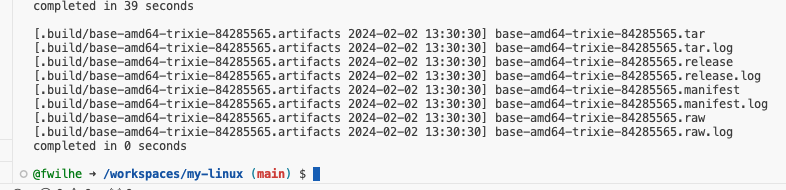
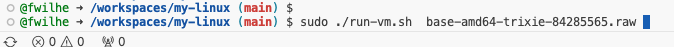

# Linux Image Template Repo

You have multiple options to build the image.
The easiest option with the least requirements to your computer is _Building with GitHub Codespaces_.

## Building with GitHub Codespaces

To build with GitHub Codespaces, first create a repository based on this template repo.



Create the repo in your own user account and give it a name.
Make the repo public.



Open a new Codespace in that repo.



Run the `build-codespace` script like this:

`./build-codespace base`

This will call the `build` script with a few Codespace specific additions.

It will take a few minutes and produce a lot of output.



Your image is built.
See the line with the `.raw` file?
That's your image.



Use that file name to run your image now using this command:

```
sudo ./run-vm.sh your-image-name.raw
```



## Building with Podman Desktop

With [Podman Desktop](https://podman-desktop.io) installed and set up, you should be able to run `./build base` from the terminal of your mac or Windows laptop.

You will need to setup [QEMU](https://www.qemu.org) to run the image.

## Building with Garden Linux Dev Image

Using the `imagebuilder-qemu-amd64` or `imagebuilder-qemu-arm64` image from https://github.com/gardenlinux/dev-image, you can get a virtual machine running that's set-up for building images.
Follow the instructions in the readme.
